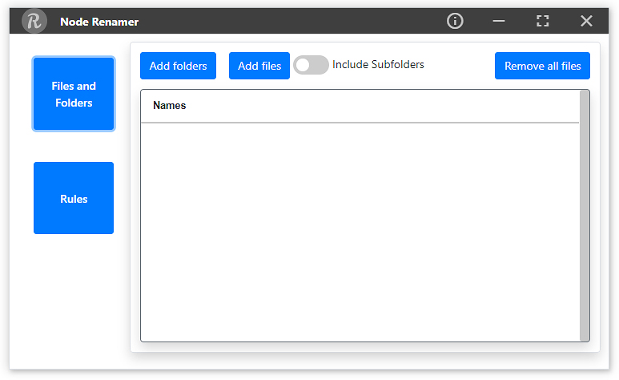

<h2 align=center>Node Renamer</h2>

 Easily Rename Multiple Files

 A Simple Cross-Platform Desktop Application Made With  <a href="https://electronjs.org"> Electron </a> That Handles Quick Bulk Renaming With Option Of Using Various Rules

</img>
</img>

        
              

## About

By using Node Renamer you can easily set up a batch rename job using multiple rules on a large number of files. The 10 different rules allow you to change file names with prefixes, suffixes, and timestamps, etc. Before renaming the files you can analyze that the output will be correct.

## Features

1.	Easily rename multiple files
2.	Process files under sub-directories
3.	Remove files or rules using right click context-menu
4.	Choose from ten rules to change file names
5.	Add multiple rules 
6.	Analyze before renaming
7.	Minimal and simple
8.	Available for Windows, Linux, and macOS

## Usage Guide

### Step 1:  
Add files, directories, and sub-directories for bulk renaming at once.

### Step 2:  
Select from the list of 10 rules to rename multiple files.  These rules are: Add Prefix, Add Suffix, Trim, Replace, Case Change, Remove, Insert At, Numbering, Time Stamp, and Reverse.

### Step 3:
Step 3: Node Renamer will show you the preview of applied rules by clicking analyze button. Apply your selected rules to rename files. 

## License
>MIT License

>Copyright (c) 2021 Jaspreet Singh

Permission is hereby granted, free of charge, to any person obtaining a copy
of this software and associated documentation files (the "Software"), to deal
in the Software without restriction, including without limitation the rights
to use, copy, modify, merge, publish, distribute, sublicense, and/or sell
copies of the Software, and to permit persons to whom the Software is
furnished to do so, subject to the following conditions:

The above copyright notice and this permission notice shall be included in all
copies or substantial portions of the Software.

THE SOFTWARE IS PROVIDED "AS IS", WITHOUT WARRANTY OF ANY KIND, EXPRESS OR
IMPLIED, INCLUDING BUT NOT LIMITED TO THE WARRANTIES OF MERCHANTABILITY,
FITNESS FOR A PARTICULAR PURPOSE AND NONINFRINGEMENT. IN NO EVENT SHALL THE
AUTHORS OR COPYRIGHT HOLDERS BE LIABLE FOR ANY CLAIM, DAMAGES OR OTHER
LIABILITY, WHETHER IN AN ACTION OF CONTRACT, TORT OR OTHERWISE, ARISING FROM,
OUT OF OR IN CONNECTION WITH THE SOFTWARE OR THE USE OR OTHER DEALINGS IN THE
SOFTWARE.

## Support

All Kinds Of Supports Are Welcome :raised_hands:! The Most Basic Way To Show Your Support Is To Star :star2: The Project, Or To Raise Issues :speech_balloon: 

Happy Coding

